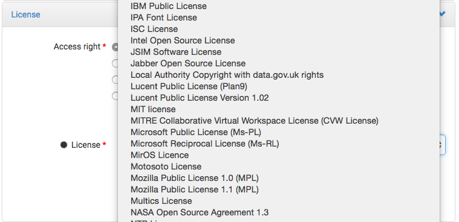
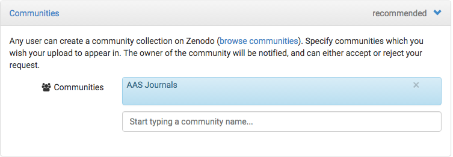
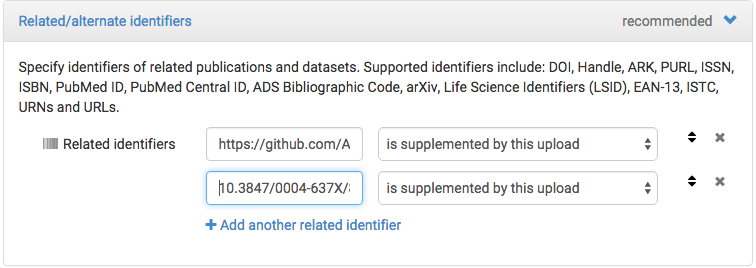

# Using Persistent Repositories in AAS Journals (AJ/ApJ/ApJL/ApJS/RNAAS)

AAS Journals strongly encourage authors to place data or software products related to an article into a persistent repository linked to the main journal article by a [DOI][9f8a762d]. This is a change from our past use of supplementary tar.gz files to append various types of article related material. This tutorial describes the processes for choosing a repository and curating digital objects in those repositories. 

Two articles that might aide your decisions about archiving data/sofware include: **"Ten Simple Rules for the Care and Feeding of Scientific Data**" [(doi:10.1371/journal.pcbi.1003542)](https://doi.org/10.1371/journal.pcbi.1003542)" and **"Achieving human and machine accessibility of cited data in scholarly publications"** [(doi:10.7717/peerj-cs.1)](https://doi.org/10.7717/peerj-cs.1)". Please note that depositing your data objects is only the first step to making these materials useful for your reader.   

Instructions for mentioning and citing these digital objects in  an AAS Journal manuscript are provided in "[Citing Repositories][7c9b06c7]."

## Software Repositories
Per the [AAS Journals' policy on Software](http://journals.aas.org/policy/software.html) we recommend that software used as part of the research process be persistently archived and cited in the final article text and references as a first class citation. This includes code of the classes:
- Reusable software packages created as a product of the research presented in the manuscript;
- Software scripts for the replication of analysis or figures or data presented in a manuscript.

Authors of such content should be careful to make informed, collaborative decisions about which authors and contributors should be included with these software releases. Archived codes should be licensed (*at the archive*) and to the extent relevant for the code, [semantically versioned](https://semver.org/). Additional curation recommendations are given below, and authors may wish to read **"Software citation principles**" [(doi:10.7717/peerj-cs.86)](https://doi.org/10.7717/peerj-cs.86)" for additional analysis of the underlying goals of software citation.

The two most common workflow for authors to persistently archive and cite their codes include:
- Direct transfer from a tagged and released GitHub repository to Zenodo. This [workflow is documented](https://guides.github.com/activities/citable-code/), and produces a versioned software release. Developers using this workflow should pay very careful attention to matters of authorship as encoded by GitHub/Zenodo workflow and edit the necessary field appropriately.
- Direct deposit of packaged software (zip/tar.gz) into one of the repositories listed below. This may or may not produce a properly versioned archival software package.

## Article Related Content
There are many additional types of article related content that are best served by archiving them in persistent repositories. These include:
- Software parameter and output files, e.g., MCMC chains;
- Reduced observational data, e.g., FITS images;
- Large computational or visualization datasets.

Individual repositories offer better search, discovery, and access mechanisms for these types of data products than the extant practice of burying them in an article's supplementary materials. Over the past few years a number of open repositories affiliated with long lived institutions have come into existence, accepting a wide array of materials with larger storage sizes than currently allowed by the Journals. We now recommend authors use these services for preserving related content.

It is important to remember that certain materials are considered central to the final article and **should continue to be submitted with the manuscript.** The Journals consider preservation and association of such material with the final article  impotant and part of our charge in publishing your article(s). Such central, associated content includes:
- Tables of results, e.g., catalogs;
- Movies, audio recordings, or other animations;
- Compendium or atlas of images, e.g., "Figure Sets";
- Data directly related to a figure, e.g., "Data behind the Figure,";
- Interactive Figures. 

Currently there are no persistent platforms for author generated websites, e.g., a project website that contains arbitrary custom visualizations of data products. While these are common in astronomy, the act of archiving and preserving them today still involves saving only the low level data objects in persistent repositories. 

## Recommended Repositories
There are a number of astronomy specific and/or generic repositories that we recommend authors use for archiving and linking you data or software to AAS Journal articles. At present, the AAS does not have contractual relationships with any of these, but consider them to be valid archives for your use. In addition to the repositories described here there are also institutional repositories that preserve such data products and issue DOI data links, so you might contact your institution's librarian to see if they provide a similar service. 

90% of the effort in creating a dataset in one of these data repositories involves drag and dropping files into a web based workflow, and filling out metadata fields. We estimate that it should take about 30 min of work not withstanding upload times.  The AAS Data editors are happy to assist you with any questions you have about these repositories or help solve problems that you experience when working with them. Please contact the [Data Editors helpdesk](mailto:data-editors@aas.org).

Some of these services directly connect to other everyday research tools like Dropbox and Github. Please see the comparison matrix below for more information on these.

#### Astronomy Specific Repositories
The following astronomy archives offer data preservation platforms that mint DOIs for specific categories of data. They may or may not be available for your particular project:
- Canadian Advanced Network for Astronomical Research (CANFAR); http://www.canfar.net/en/docs/digital_object_identifiers/

#### Generic Repositories
There are a number of open "generic" data repositories that serve all fields from communities around the world:
- [Zenodo][83fcbbbf]
- [figshare][f93cb6fe]
- [Harvard Dataverse][c2dfe768]

  [83fcbbbf]: https://zenodo.org/ "Zenodo"
  [f93cb6fe]: http://figshare.com/ "figshare"
  [c2dfe768]: https://dataverse.harvard.edu/ "Dataverse"

All of these register DataCite DOIs for individual repository records. A "record" varies somewhat in its definition, classification, and defaults between these repositories. There are a variety of differences between these repositories that may influence your decision to utilize one or another of them. Please review the comparison table below to help you make your decision.

The AAS Journals maintain curated ''collections'' in each of these generic repositories; you will find those collection links in the comparison table below. A curated collection means that your dataset will appear collated with other datasets from AAS Journals, which helps readers find related content and helps the Editorial team review and suggest metadata improvements to linked datasets. Please submit your AAS Journal related data set to the appropriate AAS Journal Collection. This can often be done after you have posted the material.

## Curating your Repository

Curation is a critical part of publishing digital objects. The amount of effort you put into correctly describing the data or code you've preserved directly affects its discovery and reuse. The AAS Journals request that you focus on 4 specific tasks when curating your data: authorship, licensing, community, and linking. 

#### Authorship
Please ensure that the authorship for your repository matches what you want the authorship of the data or code to actually be. Sometimes a piece of code will be just yours, and in other cases it is born out of a collaboration; sometimes the repository authoring should match the authorship of the corresponding paper. Unfortunately workflows like, Zenodo+Github, can only guess contributor names based on GitHub metadata, or can choose only the repository owner by default. In the example below we created an organizational user as the lead author, but please do not include the AAS Journals Team in your author list. 

#### License 
It is critical to always license the objects you share for reuse. All rights are reserved to the author for unlicensed objects, making them almost impossible to reuse. When using a repository to release material be explicit about the license and ensure that it matches the license used elsewhere, e.g., on GitHub. 

#### Communities
You may want to list the data or code in the AAS Journals "Community". This is something the AAS Journals are doing to raise awareness of codes published in our Journals. It is as simple as submitting the preserved object to a community when you are creating it. 

#### Relationship to the Final Article
This is the section you will update once your manuscript is finally published. If you look at this section today, then you will see that the first entry establishes the relationship between the github repository and this Zenodo archive. That one should be kept unchanged. Once your manuscript is published you should add a new field, entering the ApJ article "DOI" as a Related Identifier. The proper semantic relationship in this case is "is supplemented by this upload". Once you've added this material it will appear on the main landing page for the Zenodo entry. There are other semantic relationships you could choose depending upon the types of links you add to your repository object. 

## Repositories Comparison Lookup Table

### **[Zenodo](https://zenodo.org/)**

| Feature | Comments |
|---|---|
| **AAS Journals Collection**   | Zenodo **AAS** Community [Deposit Link](https://zenodo.org/deposit/?c=aas) | 
| **What is a DOI record?**     | A DOI record points to a group of files uploaded as a batch; a record assigned 1 of 8 "types" regardless of the content of the batch | 
| **Record Types**              | Publication, Poster, Presentation, Dataset, Image, Video/Audio, Software, Lesson |
| **Collections of "objects”**  | Communities |
| **Other features**            | Github/Zenodo [Making Your Code Citable](https://guides.github.com/activities/citable-code/); PDF rendering; pre-reserve DOIs; versioned and concept DOIs |
| **File size limit**           | <50GB |
| **Record Limit**              | 50GB total per record (DOI) |
| **Metadata**                  | Rich |
| **File Level Metadata?**      | None |
| **Semantics?**                | Good relational related identifier schema |
| **Licensing?**                | Pretty much any standard option possible for the record. |
| **Versioning?**               | Serial file versioning; Metadata edits do not trigger versions; "Concept" DOIs pointing to latest version of record; always version and use semantic versioning |
| **Embargo?**                  | Open, Embargo, Restricted, Closed, Not-submitted |
| **Record description**        | Limited HTML; Lists but no tables (stripped out) |
| **Individual File URLs**      | Yes, human readable file links: `https://zenodo.org/record/<record#>/files/filename.ext` |
| **Upload options**            | Desktop; Github |
| **Who are they?**             | CERN Library |
| **Pricing/Policies/FAQ**      | http://help.zenodo.org/ |
| **Citation Policy**           | See recommended citation on individual record landing page |
| **Preservation Policy**       | http://about.zenodo.org/policies/ |
| **Other tips/tricks**         | Watch auto-generated GitHub=>Zenodo metadata; use 'Additional notes' for attribution requirements; use semantic versioning for version field |
| **API information**           | http://developers.zenodo.org/ |
|   |   |
|   |   |

### **[Harvard Dataverse](https://dataverse.harvard.edu/)**

| Feature | Comments |
|---|---|
| **AAS Journals Collection**   | AAS Journals [Dataverse](https://dataverse.harvard.edu/dataverse/aas) | 
| **What is a DOI record?**     | A DOI record points to a group files called a Dataverse *Dataset* |
| **Collections of "objects”**  | Dataverses |
| **Record Types**              | Look for "Kind of Data" (Uncontrolled vocabulary) |
| **Other features**            | ORCID support; FITS file metadata extraction; astronomy specific metadata; file level metadata |
| **File size limit**           | 2.7 Gb |
| **Record Limit**              | Unlimited though large numbers of files in a Dataset can cause usability issues |
| **Metadata**                  | Rich++ |
| **File Level Metadata?**      | Descriptions; Tagging (User assigned) |
| **Semantics?**                | Related Publications encoded by indentifer type, e.g., DOI, arXiv; no relational semantics |
| **Licensing?**                | CC0 or custom assigned terms of use |
| **Versioning?**               | Serial *internal* versioning; Metadata edits trigger X.Y versions; Only 1 DOI ever minted for any record |
| **Embargo?**                  | User permissions model; file level restrictions; |
| **Record description**        | Limited HTML (permitted tags listed); Lists but no tables |
| **Individual File URLs**      | Download URLs avaible on file landing pages and via API |
| **Upload options**            | Desktop; Dropbox |
| **Who are they?**             | Harvard University |
| **Citation Policy**           | https://dataverse.org/best-practices/academic-credit |
| **Preservation Policy**       | https://dataverse.org/best-practices/harvard-dataverse-preservation-policy |
| **Pricing/Policies/FAQ**      | http://best-practices.dataverse.org/harvard-policies |
| **API information**           | http://guides.dataverse.org/en/latest/api/index.html (generic to all Dataverse installs) |
| **Other tips/tricks**         | File tagging can be useful to create subsets of a record ("dataset") |
|   |   |
|   |   |

### **[figshare](http://figshare.com/)**

| Feature | Comments |
|---|---|
| **AAS Journals Collection**   | None |
| **What is a DOI record?**     | Each uploaded “file” or fileset can have 1 of N types; files can be grouped into *Collections*; any of these (files or Collections) can be assigned a DOI | 
| **Record Types**              | Figure, Media, Code, Dataset (Tables), Poster, Paper, Thesis, Code, Presentation, Fileset (for groups of related files) |
| **Collections of "objects”**  | Public Collections can have DOI; Private Projects & Collections |
| **Other features**            | Excellent previews (csv, markdown, FITS, etc); pre-reserve DOI; private links; ORCID support; |
| **File size limit**           | 5 Gb |
| **Record Limit**              | Unlimited public data; 20 Gb “free, private” then $ |
| **Metadata**                  | Limited data model |
| **File Level Metadata?**      | All records have same limited metadata fields |
| **Semantics?**                | Related links (No semantics or formal encoding) |
| **Licensing?**                | Depends on Type and Public/Private data; CC0 for meta/data; various for Code; CC-By for others |
| **Versioning?**               | Serial file versioning; Metadata edits do not trigger versions; "Concept" DOIs pointing to latest version of record; |
| **Embargo?**                  | Embargo, Private (w/private links);  |
| **Record description**        | Tables can be pasted in; unclear what are the full HTML limits of the “description” field; all files and filesets have individual descriptions |
| **Individual File URLs**      | Individual “big number” filenames; not human recognizable: `http://figshare.com/download/file/#######` |
| **Upload options**            | Desktop; Desktop Uploader; GitHub;  |
| **Who are they?**             | Digital Science; Springer-Nature Startup |
| **Citation Policy**           | https://support.figshare.com/support/solutions search for "cite" |
| **Preservation Policy**       | https://support.figshare.com/support/solutions search for "backup" |
| **Pricing/Policies/FAQ**      | https://support.figshare.com/support/home |
| **Other tips/tricks**         | Public collections useful for bundling individual DOI'd items; |
| **API information**           | https://docs.figshare.com/ |
|   |   |

[7c9b06c7]: CitingRepositories.md "Citing"
[9f8a762d]: https://en.wikipedia.org/wiki/Digital_object_identifier "DOI"
